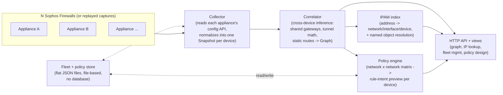

# sfos-topology — Project Overview

*A portable specification of this project's concept, architecture, domain
model and API contracts — written so it can be handed to another LLM, or
used as the spec for a from-scratch reimplementation in a different stack.
It deliberately avoids describing the current UI's literal layout, buttons
or visual design: those are implementation choices, not the project's
substance. What follows is what any reimplementation needs to preserve.*

---

## 1. Concept

Sophos Firewall's own management API has no concept of "the network" —
each appliance only knows its own interfaces, zones and routes. A fleet of
several firewalls (a company with a HQ and branch sites, say) has no single
place that shows how those appliances relate to each other: which LANs are
actually the same broadcast domain, which WAN links share an upstream,
which two appliances are the ends of the same VPN tunnel, which address is
inside which network and behind which device.

**sfos-topology is a correlator, not a monitor.** It has no access to live
traffic, ARP tables, DHCP leases or LLDP — the Sophos Firewall REST API
does not expose any of that. Everything it draws is *inferred from
configuration alone*: shared next-hops, point-to-point tunnel address
arithmetic, static routes, matching prefixes. Because every edge is an
inference rather than an observation, **every edge carries the rule that
produced it and the literal evidence for that rule**, so a wrong edge can
be traced back to a specific piece of configuration instead of shrugged off
as "the tool got it wrong."

## 2. Objective

Given a set of Sophos Firewall appliances (reachable live, or replayed from
a saved capture), produce:

1. **A single topology graph** spanning the whole fleet: devices, the
   networks they sit on, the upstream(s) they reach the internet through,
   VPN tunnels between them, and downstream devices inferred from static
   routes — each node and edge annotated with *why* it's there.
2. **An IP lookup** that answers "what is this address": which network it
   belongs to, which device(s) and interface(s) are on that network, and —
   when an administrator has named that network as a Sophos address object
   — what they called it, not just its bare CIDR.
3. **Fleet management**: add, edit and remove the appliances the tool
   watches, without hand-editing config files, and without ever putting a
   live API key in the file that's safe to commit or paste into a ticket.
4. **Macro access-control policy design**: let someone reason about
   firewall rules at the level of "network A talks to network B" across the
   whole fleet, rather than one rule form per appliance, and preview
   exactly what that implies before anything is written to a real
   appliance.

Everything ships as a **single dependency-free binary** (Go standard
library only — no framework, no database, no external services) that
builds with a bare toolchain and no module proxy. That constraint is
deliberate, not incidental: this tool is meant to run from a jump host
inside a customer's network, sometimes airgapped, where pulling
dependencies at build time is not guaranteed to work.

## 3. Design principles (preserve these in any reimplementation)

- **Evidence over confidence.** Every inferred fact — an edge, a merged
  segment, a device identity — carries a confidence level
  (`confirmed` / `inferred` / `assumed`) and a human-readable evidence
  trail. Never silently merge or assume; when two pieces of config could
  mean two different things, keep them apart and flag it rather than guess.
- **Configuration only, never live state.** No ARP, no DHCP leases, no
  LLDP, no SNMP polling. If the API doesn't expose it, the tool doesn't
  pretend to know it.
- **Stateless recomputation.** The whole graph, IPAM index and
  policy-rule-intent preview are rebuilt from scratch on every collection
  pass. Nothing is a database; nothing needs migrations; a bad pass simply
  doesn't replace the last good one.
- **File-based persistence, no database.** The only state that survives
  between runs is small, human-readable JSON files sitting next to the
  binary — the fleet definition, its secrets (kept in a *separate* file
  from the fleet definition, never inline), and the access-policy design.
  This matches the zero-dependency constraint and keeps every file safe to
  inspect, diff or hand-edit.
- **Secrets never share a file with things that get shared.** The fleet
  definition (hosts, labels) is the artifact that gets committed, pasted
  into a ticket, shown to a colleague. API keys never live in it — they're
  referenced indirectly (an environment variable name) or kept in a
  sibling file that is never meant to leave the machine.
- **No authentication by default; write access is opt-in.** The read-only
  view has no login of its own — it's meant to sit behind whatever network
  boundary or reverse-proxy auth the operator already has. Anything that
  *writes* (fleet edits, policy edits) is gated behind a single shared
  secret that must be explicitly configured; if it isn't, that whole
  surface returns "not found," not just "unauthorized" — don't expose a
  write endpoint's existence to someone who hasn't opted in.
- **Never guess a write-endpoint's schema.** Read a vendor's API docs
  skeptically if the field names can't be confirmed against a real
  captured response — and *never* write code that calls a write/mutate
  endpoint (something that changes live device configuration) based on a
  guessed schema. Guessing wrong on a read path shows a blank field;
  guessing wrong on a write path can silently misconfigure a real
  firewall. See §8 for the specific lesson that shaped this rule.

## 4. Architecture

Everything above lives in one process. There is no message queue, no
separate database service, no background workers beyond a single optional
refresh timer.

### Components (as packages, in this codebase — names are implementation
detail, but the separation of concerns is not)

| Concern | Responsibility |
|---|---|
| API client + types | Talk to one appliance's REST API; normalize its quirky JSON (three different encodings of "no value," a oneOf discriminated on a type field with a different value field per variant, pagination that never reports totals) into one clean `Snapshot` per device. Also supports replaying a saved directory of raw API responses instead of a live call — this is how the correlator gets tested without live credentials, and how a customer's capture gets debugged offline. |
| Correlator | Takes N `Snapshot`s, produces one `Graph` (nodes + edges, see §5). Pure function of its input — no I/O, no network calls, fully unit-testable. |
| IPAM index | Takes the same snapshots + the `Graph`, builds an in-memory table answering "what network/device/interface owns this address," with named-object resolution layered on top. Rebuilt every pass. |
| Policy engine | Takes the `Graph` + a persisted, user-authored network-to-network matrix, computes which appliances a given cell would touch and what rule it implies on each — a pure preview, no calls to the appliance API (see §8 for why). |
| Fleet store | Owns the on-disk fleet definition and its secrets file; the only place that reads and writes them, mutex-guarded so a concurrent read (a scheduled refresh) and a write (an edit) never interleave. |
| Policy store | Same shape as the fleet store, for the access-policy matrix. |
| HTTP layer | Serves the graph, the two interactive views, and every API below. Deliberately kept ignorant of the domain types on the other side of each endpoint — it only ever moves already-serialized bytes plus a status code, so the transport layer and the domain logic can be tested independently. |

## 5. Domain model

### Node kinds
- **Device** — one physical/virtual appliance. Identified preferably by a
  vendor-issued serial number; falls back to its management address if
  unregistered (with a warning, since that identity breaks if the
  appliance is re-addressed later).
- **Segment (network)** — a broadcast domain inferred from one or more
  interfaces sharing a prefix. Carries the CIDR, which devices are
  directly wired to it, and (see IPAM) any named address objects that
  describe it.
- **Cloud** — an upstream beyond a WAN gateway. One per distinct next-hop
  address; two appliances pointing at the same next hop share one cloud,
  different next hops are different clouds (never collapsed into one
  generic "Internet" node).
- **Gateway (inferred)** — a downstream L3 device implied by a static
  route whose next hop is not any known appliance. Represents "something
  is out there we don't have visibility into," rendered distinctly from a
  known device.
- **World (root)** — a single synthetic root every uplink eventually
  converges on, so a multi-uplink fleet reads as one drawing rather than
  several disconnected fragments.

### Orientation (drives both meaning and layout, not just visuals)
| Zone type | Orientation | Meaning |
|---|---|---|
| `wan` | north | Uplink, toward the internet |
| `lan`, `dmz` | south | Internal segment |
| `vpn`, or any tunnel-type interface regardless of its zone | overlay | Site-to-site VPN; peer-to-peer between two devices, not ranked north/south |
| `local` | management | Out-of-band management; hidden by default |
| `discover` | passive | A TAP/mirror port — carries no traffic edge at all |

### Confidence
| Level | Meaning |
|---|---|
| `confirmed` | Directly observed configuration, or corroborated by a second independent fact |
| `inferred` | A single piece of evidence implies it, with no corroboration |
| `assumed` | A weak candidate kept only because nothing contradicts it |

### Correlation rules (the actual inference engine)
| Rule | Evidence | Confidence |
|---|---|---|
| E0 | An interface holds an address in a zone | confirmed |
| E1 | Two interfaces share a prefix — candidate only | assumed |
| E3 | Two appliances share a prefix **and** the same next hop | confirmed |
| E5 | One upstream cloud per distinct WAN gateway address | confirmed |
| E6 | A static route's next hop belongs to no known appliance → an inferred gateway | inferred |
| E8 | Both host addresses of a `/30` or `/31` transit net are known devices → a confirmed VPN tunnel between them | confirmed |
| E9 | Two appliances hold the *same* address inside a prefix → cannot be one wire; kept as two separate networks that happen to reuse the same range, flagged | (splits rather than merges) |

E1 alone never merges two segments sharing a prefix — `192.168.1.0/24` at
two different sites is not one broadcast domain. Only corroborating
evidence (E3, or distinct addresses inside the same prefix with no
collision) upgrades a candidate into a merge.

### HA pairs
Two nodes of an HA cluster report near-identical configuration (same
interfaces, same addresses). Detected via a peer-registration field the
management-plane API exposes only for clustered appliances; without special
handling this reads as duplicate everything. Handling: tag the device node
with its peer's identity and a warning; a consumer should render the pair
as one logical device.

## 6. Functional capabilities

*(Described as capabilities and flows — not as specific pages, buttons or
visual layout. Any of these could be a CLI, a TUI, a single page, three
pages, or an API consumed by something else entirely.)*

### 6.1 Topology graph
- Produce the full graph described in §5 for the whole fleet in one pass.
- Every node and edge is inspectable: what evidence produced it, what
  confidence it holds, what warnings apply (e.g. "this segment collides
  with another appliance's address range").
- Two useful *projections* of the same graph, not two different data
  models:
  - **Underlay**: the physical fabric — WAN uplinks, upstream clouds, the
    root — with VPN tunnels as optional overlay detail.
  - **Overlay**: hide the WAN/upstream detail and treat the VPN tunnel
    mesh between appliances as the primary connections — "what the fleet
    looks like from inside the mesh."
- Exportable as a static artifact (e.g. for a report or a proposal) — the
  point being the graph should be shareable outside the running tool, not
  that it must be SVG specifically.

### 6.2 IP address lookup (IPAM)
- Given one IPv4 address, resolve:
  - The network (CIDR) it belongs to, and every device+interface directly
    wired to that network (a network can span more than one appliance —
    e.g. a merged WAN segment, or an HA pair).
  - The friendliest name available for that network: if a Sophos "address
    object" exists that names it, use that name; otherwise fall back to
    the bare CIDR plus the interface name — never invent a name.
  - When more than one address object could name the same address, the
    **most specific one wins**: an exact host object beats a range, which
    beats a network object, and among network objects the narrower prefix
    wins (a `/24` naming exactly this network outranks a `/16` naming the
    wider block it sits in).
  - **Scoping rule that matters**: only address objects defined *by a
    device that is actually a member of the matched network* are
    considered — an object on an unrelated appliance that numerically
    happens to cover the same address range must never be used, even
    though nothing stops two unrelated appliances from defining
    numerically overlapping objects independently. (This was a real bug
    caught during development — see §8.)
  - A network that two different appliances collide on (E9 split) is
    genuinely ambiguous for any address inside it that isn't the literal
    colliding one: report *both* candidates with a warning, rather than
    silently picking one.
- Distinguish "no valid address" (bad input) from "valid address, but no
  known network contains it" (out of scope for this fleet) — a consumer
  needs to tell those apart.

### 6.3 Fleet management
- Add, edit, remove the appliances being watched: at minimum a label and
  either (a) a reachable host + an API credential, or (b) a path to a
  previously captured/replayed snapshot.
- **Credentials never sit in the same artifact as the fleet's identity
  list.** Whatever holds "here are our firewalls" should be safe to share;
  whatever holds "here are the keys" should not, and the two must be
  separately protected (separate file, separate access control, whatever
  fits the target stack).
- Editing should trigger an immediate re-collection of at least the
  touched appliance, and report back *specifically* whether that
  appliance was reachable with the new configuration — don't make someone
  wait for a scheduled refresh to find out they mistyped a host or pasted
  a stale key.
- This is fundamentally a **local/administrative** capability, not
  something to expose without a deliberate opt-in gate (see §3).

### 6.4 Access-control policy design (macro matrix)
This is a **network-to-network macro policy designer**, explicitly not a
full per-service firewall-rule editor. The mental model:

- The axes are every network the fleet's topology discovered — with one
  important collapsing rule: **every WAN-facing network collapses into a
  single "Any" axis entry.** Nobody writes a policy against one specific
  ISP hand-off; they write it against "the internet."
- A cell between a source network and a destination network holds:
  - **Action**: allow or deny.
  - **Service scope**: always "any service" — this tool trades
    per-service precision for a simple macro switch, by design. (A richer
    reimplementation could add per-service scoping as a cell-level
    override without breaking the model.)
  - **Security Heartbeat requirement**: whether the policy should only
    match traffic from a device passing a compliance/heartbeat check.
  - **User authentication requirement**: whether the policy should only
    match traffic from an authenticated identity, not just an IP.
  - **Bidirectional flag**: a convenience that, at creation time, defines
    *both* directions as two independent policies (editing one later never
    silently touches the other).
- **Fleet-wide scope, but locally anchored.** A cell only implies a rule on
  an appliance where at least one side of the pair is a network *directly
  wired* to that appliance (the other side may be the universal "Any,"
  which never narrows the set on its own). Two specific networks that live
  on two unrelated appliances, with no third appliance's route connecting
  them, imply no rule anywhere — that is a deliberate scope boundary, not
  an oversight (see §9 for the documented extension point: detecting
  reachability via a routing policy configured on some other appliance).
- **Idempotent by design.** Each (source, destination) pair maps to a
  deterministic identifier, so re-editing a cell later should update the
  rule it previously implied rather than accumulate duplicates on the
  target appliance.
- **Rule placement matters and is easy to get wrong.** Firewalls typically
  evaluate rules in order, top-down, stopping at the first match. A newly
  created "allow" rule placed *after* an existing broad "deny" is silently
  ineffective. Any implementation of the "apply" step (see §9) must decide
  deliberately where new rules land relative to existing ones — this
  project's operators chose "append at the end," accepting the risk that a
  pre-existing catch-all deny could shadow new rules, over "insert at the
  top," which risks shadowing a pre-existing, deliberately-placed manual
  rule instead. Neither is free of risk; make the trade-off explicit.
- **If the network object a policy needs doesn't exist on a given
  appliance yet, it should be created as part of applying that policy** —
  this tool should never require the operator to pre-stage address
  objects by hand before designing a policy against them.
- Before any of this actually mutates a real appliance's rule table, the
  target API's request/response schema must be confirmed against a real
  captured example (§8) — a preview-only mode that computes and shows
  exactly what *would* be created, without calling the appliance, is a
  reasonable and safe intermediate milestone while that confirmation is
  pending.

## 7. Requirements

### Runtime
- A single static binary with no runtime dependencies — the reference
  implementation is Go against the standard library only, chosen
  specifically so it builds with a bare toolchain and no package/module
  proxy access. This constraint can be relaxed in a reimplementation if
  the airgapped/jump-host deployment scenario doesn't apply to the new
  context — but if it's relaxed, say so explicitly rather than losing it
  by accident.
- No database. Whatever state needs to persist between runs should be a
  small number of flat, human-readable files, not a schema that needs
  migrations.

### Upstream dependency
- Network reachability to each Sophos Firewall's management API (HTTPS,
  typically on a dedicated management port, self-signed certificate by
  default — expect to pin the certificate's fingerprint rather than trust
  a CA chain).
- An API credential per appliance scoped to a **read-only** administrator
  profile for everything except the policy-apply step, which additionally
  needs write access to the firewall-rule and address-object resources.
  A credential like this inherits every permission of the account that
  issued it — treat it as highly sensitive regardless of how narrowly the
  tool itself uses it.

### Deployment shape
- Should run equally well as a bare process or as a minimal container
  (no shell, no package manager, read-only root filesystem, dropped
  capabilities) — the reference deployment binds its HTTP port to
  loopback only and expects a reverse proxy or network boundary to add
  authentication for anything beyond local/trusted use.
- A on-timer refresh loop is expected (re-collect the fleet every N
  minutes), with the rule that **a failed pass keeps the previous good
  result visible** rather than blanking out to an error state — a stale
  picture is more useful than no picture, as long as its age is visible.

### Non-requirements (explicitly out of scope for the reference project)
- No multi-user accounts or role-based access control — a single shared
  secret gates all write access.
- No historical/time-series view — always current-state only, rebuilt
  from scratch every pass.
- No live traffic visibility of any kind.

## 8. API surface

### This tool's own HTTP API
| Method & path | Purpose | Write-gated? |
|---|---|---|
| `GET /` | Topology graph view | no |
| `GET /policy` | Access-policy matrix view | no (view loads; its data calls are gated, see below) |
| `GET /graph.json` | The current graph, as JSON | no |
| `GET /healthz` | Liveness probe (process is serving, not that every appliance answered) | no |
| `GET /api/ipam/{ip}` | Resolve one IPv4 address (§6.2). `400` invalid address, `404` no known network, `200` + JSON otherwise | no |
| `GET /api/devices` | List the fleet (never returns credential values, only whether one is set) | **yes** |
| `POST /api/devices` | Add a device | **yes** |
| `PUT /api/devices/{label}` | Edit a device (blank credential field = keep existing) | **yes** |
| `DELETE /api/devices/{label}` | Remove a device | **yes** |
| `GET /api/policy` | Current policy matrix: every discovered network (axes) + every defined cell + the rule-intent preview it currently implies | **yes** |
| `PUT /api/policy/cell` | Create/update one cell (`{source, destination, action, requireHeartbeat, requireAuth, bidi}`) — stores the design only, does not touch a firewall | **yes** |
| `DELETE /api/policy/cell?source=...&destination=...&bidi=...` | Remove one cell (query params, not path segments, because a network id is a CIDR-shaped string containing `/`) | **yes** |
| `POST /api/policy/apply?source=...&destination=...` | Apply a cell that has already been saved: creates any missing address object, then creates or updates the real rule on every applicable appliance. Returns `{results: [{device, ruleName, status, error?}]}`, one entry per device, so one appliance's failure doesn't hide the others' success | **yes** |

Write-gated endpoints: disabled entirely (404, indistinguishable from "this
route doesn't exist") unless an admin secret has been explicitly
configured; when configured, every request must present it via a header,
compared in constant time.

### Upstream Sophos Firewall REST API endpoints consumed
Base path: `/api/firewall-config/v1`. Pagination: request a page size,
watch for a short page as the termination signal — **do not rely on a
reported total**, it's frequently absent.

| Endpoint | Feeds |
|---|---|
| `GET /network/zones` | Orientation (north/south/overlay/management/passive) |
| `GET /network/interfaces/network-interfaces` | The whole interface inventory |
| `GET /routing/gateways/ipv4` | Gateway objects |
| `GET /routing/gateways/wan/ipv4` | Link weight, backup, health checks |
| `GET /routing/static-unicast-routes/ipv4` | Downstream inferred gateways |
| `GET /network/dhcp/servers/ipv4` | Scopes and static reservations |
| `GET /ipsec-vpn/site-to-site/connections/ipv4` | Tunnel endpoint metadata |
| `GET /network/addresses/ipv4` | Named address objects, for IPAM naming |
| `GET /administration/system-settings` | Hostname |
| `GET /sophos-central/status` | Serial number, HA peer registration |

| `POST /network/addresses/ipv4` | Create a named address object, when the policy-apply step needs one that doesn't exist yet |
| `GET /firewall/rules/ipv4/:name` | Check whether a cell's rule already exists, to decide create vs. update |
| `POST /firewall/rules/ipv4` | Create a rule (requires `ruleType:"firewall"` and `position`, neither of which appears on a GET response — see the lesson below) |
| `PATCH /firewall/rules/ipv4/:name` | Update a rule (partial update, addressed by name) |
| `DELETE /firewall/rules/ipv4/:name` | Delete a rule |

`POST /firewall/rules/ipv4/move` (reposition an existing rule) is identified
but not integrated: the matrix always appends new rules at the end and never
reorders, so nothing in this project has needed it, and its request body
shape has not been confirmed against a live capture.

### The most important lesson from this project's history

The vendor's interactive API documentation for at least two endpoints
(named address objects, and firewall rules) renders its request/response
schema **client-side in the browser** — fetching the page's HTML yields
the endpoint path and the HTTP status codes, but *no field names at all*.
This project shipped a naming feature once with a schema guessed from a
long-stable legacy XML API's field names, camelCased to match this REST
API's general convention. It was **wrong on every field except the two
that happened to be spelled the same** (`id`, `name`) — every object
silently decoded to its zero value, and the feature appeared to work
(returned a value, no errors) while actually never matching anything real.
It was only caught because a user pasted a real captured response.

**The rule this produced: before writing code against any endpoint whose
schema can't be confirmed from documentation, get one real captured
response (a authenticated `curl` against a live or lab appliance is
enough) and derive the struct/type from that, not from the docs or from
a same-vendor legacy API's naming.** This matters more, not less, for
write endpoints — a wrong read silently shows nothing; a wrong write
silently does the wrong thing to live configuration.

## 9. Known limitations / explicit non-goals of the reference implementation

- **SD-WAN-routed reachability is not detected.** The policy engine (§6.4)
  only recognizes a network as "on" an appliance when an interface is
  directly wired to it. An appliance that reaches a remote network only
  through a configured routing/SD-WAN policy pointing at it is not
  detected as needing a rule for that network. Extending this needs a
  second upstream resource (SD-WAN policy routes) whose schema has not yet
  been confirmed against a live capture — do not guess at it; capture
  first, per §8.
- **IP Host Groups are not resolved** for IPAM naming — only individual
  address objects (single IP, network, range, or a flat list of
  addresses). A group that references other objects by name is invisible
  to the naming logic.
- **No MAC-based adjacency.** The management API does not expose the
  burned-in hardware address (only an administrative override, when set),
  so ARP-style adjacency inference is not possible from this API alone.
- **Zone type is coarser than the zone list** — e.g. a built-in "guest
  Wi-Fi" zone may report the generic `lan` type. Orientation must always
  be derived from type, never from a zone's display name.
- **Out-of-band management interfaces are indistinguishable from regular
  LAN interfaces** in the API — nothing marks a port as "this is the
  management network." A reimplementation may want to let an operator tag
  this manually and persist that tag.
- **Duplicate serial-less identity.** An appliance not registered with the
  vendor's cloud management has no serial number; falling back to its
  management address as an identity key is lossy (breaks if the appliance
  is later re-addressed). Worth a visible warning wherever this fallback
  is used.

## 10. Guidance for a from-scratch reimplementation

1. **Port the correlation rules (§5) faithfully before anything else.**
   They are the hardest-won, most domain-specific part of this project —
   pure functions over a normalized snapshot, with no dependency on
   networking, storage or UI. They translate to any language easily and
   are the one piece that would be a genuine loss to redo from first
   principles rather than port.
2. **Keep the evidence trail even if nothing else about the presentation
   survives.** The property "every edge can justify itself" is what makes
   the tool trustworthy in front of a skeptical audience (a customer, a
   senior engineer double-checking the tool's work) — losing it turns a
   defensible inference engine into an opaque guess generator.
3. **Re-derive types from real captures, not from memory of this
   document's tables.** The endpoint list in §8 is accurate as of this
   writing, but Sophos's API can and does change between firmware
   versions; validate before trusting.
4. **Decide deliberately, don't inherit by default, on**: whether the
   zero-dependency/single-binary constraint still matters in the new
   context; whether file-based persistence is still appropriate at the
   expected scale; whether the single-shared-secret write gate is
   sufficient or whether the new context needs real multi-user auth.
   These were the right calls for *this* project's stated deployment
   scenario (a consultant's jump-host tool for customer engagements); they
   are not universal truths.
5. **The policy-apply step is the one genuinely unfinished piece** — the
   design (§6.4) is complete and deliberately conservative (preview before
   write, idempotent naming, explicit rule-placement trade-off), but
   wiring it to a real appliance needs the captured schema first. Treat
   that as the concrete next milestone, not an open-ended research task.
